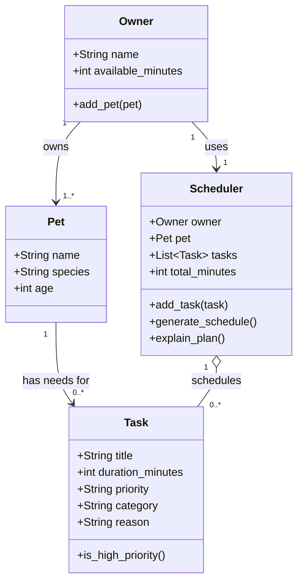

```mermaid
classDiagram
    class Owner {
        +String name
        +int available_minutes
        +add_pet(pet)
    }

    class Pet {
        +String name
        +String species
        +int age
    }

    class Task {
        +String title
        +int duration_minutes
        +String priority
        +String category
        +String reason
        +is_high_priority()
    }

    class Scheduler {
        +Owner owner
        +Pet pet
        +List~Task~ tasks
        +int total_minutes
        +add_task(task)
        +generate_schedule()
        +explain_plan()
    }

    Owner "1" --> "1..*" Pet : owns
    Owner "1" --> "1" Scheduler : uses
    Pet "1" --> "0..*" Task : has needs for
    Scheduler "1" o-- "0..*" Task : schedules
```
